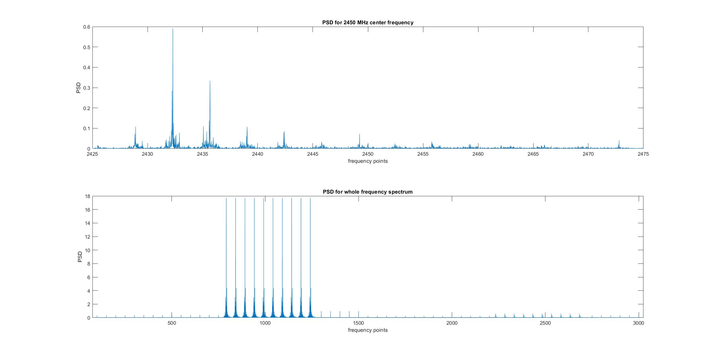

# A repo to save IQ signals for wide band from 100MHz to 3GHz and plot them to visualize the occupied frequencies.
- Python script: Collect data using USRP and save to a csv file.
- Matlab script: Process the IQ signal to matrix and plot all bands.

